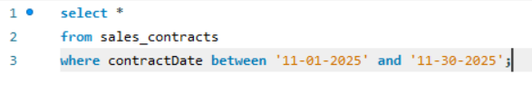

I found this query interesting, because it managed to find the 'between' value in what is essentially a string of numbers. I assume this has something to do with a default in alphanumerical sorting.